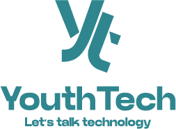

# YouthTech Website - Developed by TwickLink

<div align="center">
  
  
  [](https://opensource.org/licenses/MIT)
  [](https://reactjs.org/)
  [](https://vitejs.dev/)
  [](https://twicklink.com)
</div>

## 🌟 About YouthTech

YouthTech is a non-governmental organization dedicated to fostering comprehensive understanding of technology and innovation within the Tanzanian community. We are committed to bridging the digital divide by ensuring that Tanzania's youth, particularly children and women, are well-informed and educated in critical areas such as:

- 💻 **Software Development**
- 🔒 **Cybersecurity**
- 🌐 **Web Design**
- 🤖 **Artificial Intelligence**
- 💻 **Programming**

## 🎯 Our Mission

To empower the Tanzanian community through inclusive education on Information and Communication Technology (ICT) and Artificial Intelligence.

## 🚀 Our Vision

To promote technology adoption within the community, empowering individuals through ICT and AI education and training.

## 🎓 Thematic Areas

### 1. ICT Education Support
- Providing essential resources like computers and internet access
- Organizing targeted training workshops
- Developing educational materials
- Establishing mentorship programs

### 2. Cybersecurity Training Advocacy
- Promoting comprehensive cybersecurity training programs
- Raising awareness about digital security
- Protecting sensitive information and digital assets
- Ensuring online safety for the community

### 3. Artificial Intelligence Community Support
- Fostering AI awareness and education
- Providing access to AI tools and resources
- Encouraging collaborative AI projects
- Creating innovation-friendly environments

## 🛠️ Technology Stack

This website is developed by **TwickLink** using modern web technologies:

- **Frontend**: React 18+ with Vite
- **Styling**: Tailwind CSS
- **Icons**: Lucide React
- **Build Tool**: Vite
- **Package Manager**: npm
- **Development Team**: TwickLink

## 🚀 Getting Started

### Prerequisites

- Node.js (v18 or higher)
- npm or yarn package manager

### Installation

1. Clone the repository:
```bash
git clone https://github.com/Twick-Inc/tech4youth.git
cd tech4youth
```

2. Install dependencies:
```bash
npm install
```

3. Start the development server:
```bash
npm run dev
```

4. Open your browser and navigate to `http://localhost:5173`

## 📁 Project Structure

```
tech4youth/
├── src/
│   ├── components/
│   │   └── Navbar.jsx          # Enhanced navigation component
│   ├── assets/
│   │   ├── youth-tech-logo.png
│   │   └── team/              # Team member photos
│   ├── pages/                 # Page components
│   ├── App.jsx               # Main application component
│   └── main.jsx              # Application entry point
├── public/                   # Static assets
└── package.json             # Project dependencies
```

## 🎨 Features

- **Responsive Design**: Mobile-first approach with Tailwind CSS
- **Smooth Animations**: Enhanced scroll behavior and transitions
- **Modern Navigation**: Clean, professional navigation bar
- **Accessibility**: WCAG compliant design patterns
- **Performance**: Optimized with Vite for fast development and builds

## 👨‍💻 Development Team

This project is exclusively developed by **TwickLink**, a professional web development company contracted by YouthTech.

### Development Guidelines

- Follow React best practices
- Use meaningful commit messages
- Ensure responsive design
- Test across different browsers
- Maintain accessibility standards
- TwickLink internal development standards

## 📞 Contact Information

### YouthTech Organization
- **Visit Us**: Kilimanjaro Region, Tanzania
- **Talk to Us**: +255 764 454 097
- **Write to Us**: info@youthtech.or.tz

### TwickLink Development Team
- **Website**: [twicklink.com](https://twicklink.com)
- **Development**: Professional web development services
- **Project**: YouthTech website development contract

## 🌐 Social Media

Follow us on social media for updates and community engagement:

- [Facebook](https://facebook.com/youthtech)
- [Twitter](https://twitter.com/youthtech)
- [YouTube](https://youtube.com/youthtech)
- [LinkedIn](https://linkedin.com/company/youthtech)
- [Instagram](https://instagram.com/youthtech)

## 📄 License

This project is licensed under the MIT License - see the [LICENSE](LICENSE) file for details.

## 🙏 Acknowledgments

- YouthTech organization for the development contract
- Tanzanian tech community for inspiration and support
- Educational institutions and partners
- Volunteers and mentors who make YouthTech's mission possible

---

<div align="center">
  <p><strong>Empowering Tanzania's Future Through Technology</strong></p>
  <p>Website developed with ❤️ by <strong>TwickLink</strong> for YouthTech</p>
</div>